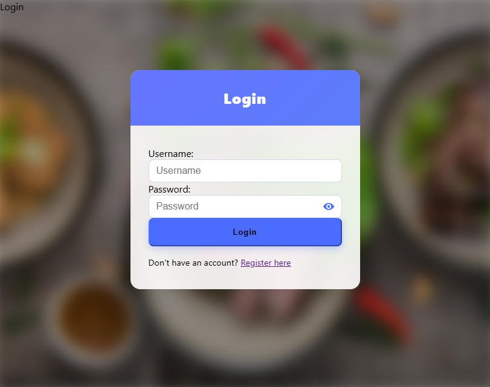

# 🍽️ User-Generated Recipe Collection

A full-featured Django-based web application that allows users to **create**, and **explore** recipes. This project promotes culinary creativity through a user-friendly platform with features like **ratings**, **categories**, **search**, and optional **buy/sell** options.

---

## 🚀 Features

- 📝 Create and share recipes with images
- 🔍 Search recipes by keyword or tag
- 📂 Browse recipes by category
- ⭐ Add ratings
- 🛒 Buy and sell recipes
- 📨 Email notifications (for creation, rating, buying)
- 👤 User authentication (register/login/reset password)
- 📱 Mobile-responsive modern UI (Bootstrap 5 + custom CSS)

---

## 🖼️ Screenshots

### 🏠 Home Page


### 🔐 Login Page


### 📝 Registration Page


### 👤 User Profile


### 🍽️ Recipe Detail Page


### ✍️ Recipe Creation Form


### 🔑 Password Reset Page


### ✅ Password Reset Done

---

## 🛠️ Tech Stack

- **Backend**: Django (Python)
- **Frontend**: Bootstrap 5, HTML5, CSS3, JavaScript
- **Database**: SQLite (for development)
- **Authentication**: Django built-in auth system
- **Email Service**: SMTP (for sending notifications)

---

## ⚙️ Setup Instructions

### 1. Clone the Repository
```bash
git clone https://github.com/Swapnamh/user-generated-recipe-collection.git
cd user-generated-recipe-collection
2. Set Up Virtual Environment
bash
Copy
Edit
python -m venv venv
venv\Scripts\activate  # On Windows
3. Install Dependencies
bash
Copy
Edit
pip install -r requirements.txt
4. Run Migrations
bash
Copy
Edit
python manage.py makemigrations
python manage.py migrate
5. Create Superuser (optional)
bash
Copy
Edit
python manage.py createsuperuser
6. Run the Development Server
bash
Copy
Edit
python manage.py runserver
Open your browser and visit:
📍 http://127.0.0.1:8000/


